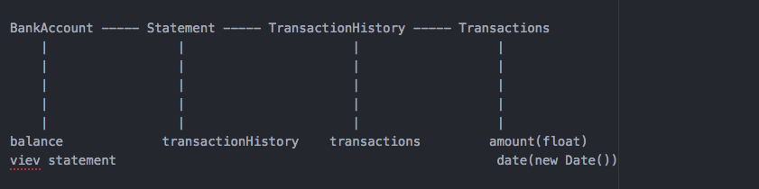
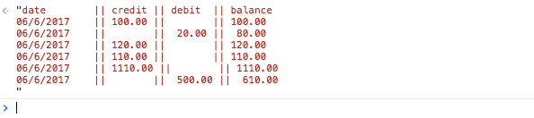
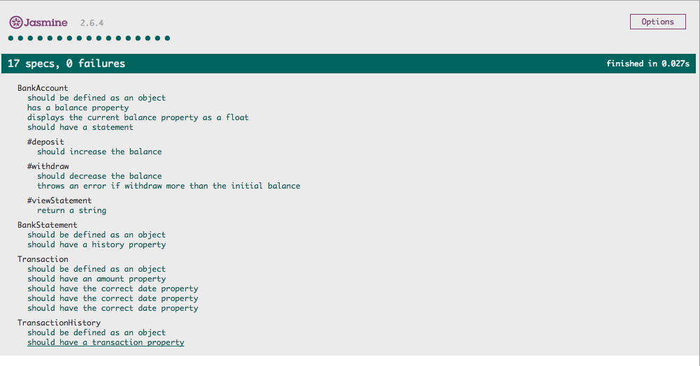
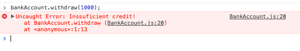

## Tasks

* You should be able to interact with the your code via a REPL like IRB or the JavaScript console. (You don't need to implement a command line interface that takes input from STDIN.)
* Deposits, withdrawal.
* Account statement (date, amount, balance) printing.
* Data can be kept in memory (it doesn't need to be stored to a database or anything).

## User storyes

As a client
So I can store my money in a safe place
I would like to make a deposit in to my account.

As a User
So I can take some extra money when I need
I would like to ake a withdraw from my bank Account.

As a user
So I know how much money I have left
I would like to see my bank Account current balance.

As a User
So I can keep track of my bank balance
I would like to see a statement of all my transactions.

### Below is the domain model for my bank programe develped before implementation:

## Process

* Before creating each object I added a TransactionSpec.js, BankAccountSpec.js,TransactioHistorySpec and BankStatementSpecFiel.js files that were testing if the objects exists.
* After creating the first test I started implementing the features meaning starting writing the methods
* I created a bankAccount class with a deposit and withdraw methods with the ability to print the statement as well
* The Transaction class holds the amount properties and date time of the transactions
* The TransactionHistory class has transactions as properties which are stored as an array of objects
* The BankStatement class has as property the transactionHistory object

## Instructions and instalation

* Fork this repo
* Open SpecRunner.hmtl
* Open the developer tools (cmd+ alt + i)
* Create a new bank account by entering bankAccount = new BankAccount() where bankAccount is a variable.Then make a deposit, withdraw and view the statement:
 - bankAccount.deposit(), makes a deposit
 - bankAccount.withdraw() withdraw a certain amount from the bank account
 - bankAccount.viewStatement(), displays the statement and the current balance

## Statement view

## All models are tested, all tests passed

## Throws an error when you try to withdraw an amount greater than your current balance:

